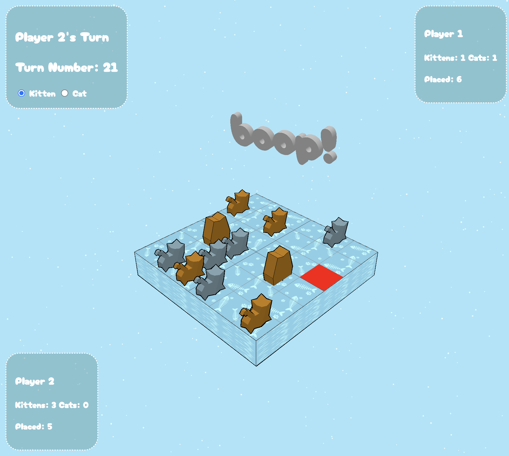

# Roadmap
## Bugs
- [] Selecting graduation choice picks opposite group of 3
- [x] Server handling of multiple concurrent games

## Features
- [] Highlight selection choice options when multiple graduation options are available 
- [] Status message for waiting on Player Actions (Move, Select piece or row to graduate)
- [] Animations
- [] Production webpage + webservices
- [] BGM
- [] UI / Icons to select between piece types 
- [] Authentication / Only 1 active game per IP
- [x] Homepage with list of active available games to join